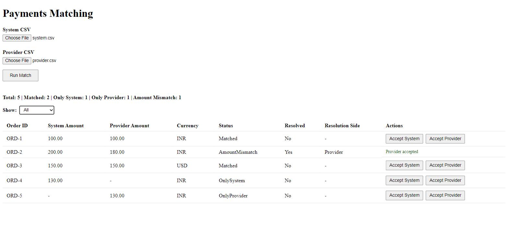
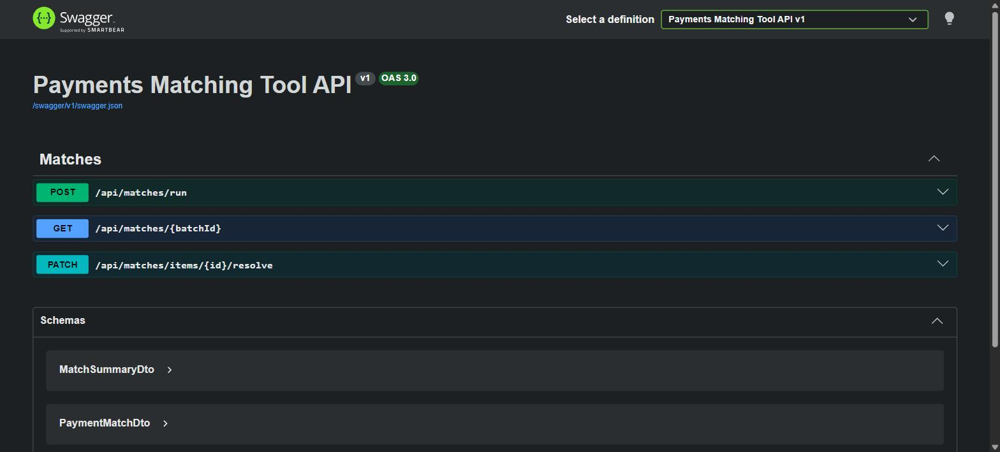
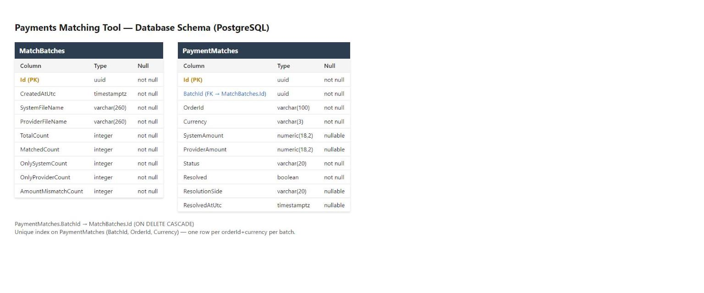

# Payments Matching Tool

Upload a System CSV and a Provider CSV, match them by `orderId + currency`, and resolve any
mismatches by accepting either the System or Provider side.

- **Frontend:** Angular 20 (standalone components, signals)
- **Backend:** .NET 10 Web API (Domain / Application / Infrastructure / Api layering)
- **Database:** PostgreSQL (EF Core + Npgsql)

## Run with Docker (recommended)

Requires Docker Desktop.

```bash
docker compose up --build
```

- Frontend: http://localhost:4200
- API + Swagger: http://localhost:5082/swagger
- Postgres: localhost:5432 (`postgres` / `postgres`, db `payments_matching`)

The API applies EF Core migrations automatically on startup, so the database schema is created
for you. The Angular app is served by nginx, which proxies `/api` to the API container — no CORS
setup needed in this mode.

## Run locally without Docker

**Prerequisites:** .NET 10 SDK, Node.js 20+, a PostgreSQL instance.

### Backend

```bash
cd backend
# point at your own Postgres, e.g.:
export ConnectionStrings__Default="Host=localhost;Database=payments_matching;Username=postgres;Password=postgres"
dotnet run --project src/PaymentsMatchingTool.Api
```

API listens on `http://localhost:5082` (see `src/PaymentsMatchingTool.Api/Properties/launchSettings.json`).
Swagger UI is at `/swagger`. Migrations are applied automatically on startup.

Run the unit tests:

```bash
cd backend
dotnet test
```

### Frontend

```bash
cd frontend/payments-matching-tool
npm install
npm start   # ng serve, http://localhost:4200
```

`src/environments/environment.development.ts` points `ng serve` at `http://localhost:5082/api`.
Run the unit tests with:

```bash
npm test
```

## Matching behavior

Both CSVs use the format `orderId,amount,currency`. Rows are keyed by `orderId + currency` and
classified as:

- **Matched** — same amount in both files
- **AmountMismatch** — present in both files with different amounts
- **OnlySystem** — only in the System CSV
- **OnlyProvider** — only in the Provider CSV

Each match run is persisted as a batch; resolving a row (Accept System / Accept Provider) updates
that row's `resolved` / `resolutionSide` in the database.

## Assumptions

- Currency is restricted to `USD, EUR, INR, GBP` per the spec; any other value is a validation error.
- If the same `orderId + currency` appears more than once within a single file, the **last row
  wins** (rows are read in order, later rows overwrite earlier ones for that key).
- Amounts are compared at 2 decimal places (`Math.Round(x, 2)`), matching the `numeric(18,2)` column type.
- Each match run creates a new batch rather than overwriting the previous one. The UI only shows
  the batch from the most recent run in the current browser session (no batch-history picker),
  but old batches remain queryable via `GET /api/matches/{batchId}` and are not deleted.
- No authentication — this is a single-user internal tool per the spec.
- The `Resolved`/`Resolution Side` columns and Accept buttons are shown for every row (not just
  mismatches), matching the sample table in the spec.

## API

- `POST /api/matches/run` — multipart form (`SystemFile`, `ProviderFile`) → runs the match, returns
  `{ batchId, summary, items[] }`
- `GET /api/matches/{batchId}?filter=unresolved|resolved|all` — list items for a batch
- `PATCH /api/matches/items/{id}/resolve` — body `{ "resolutionSide": "System" | "Provider" }`

## Screenshots

**UI after running a match** (mismatch resolved, filter set to "All"):



**Swagger:**



**Database schema:**


